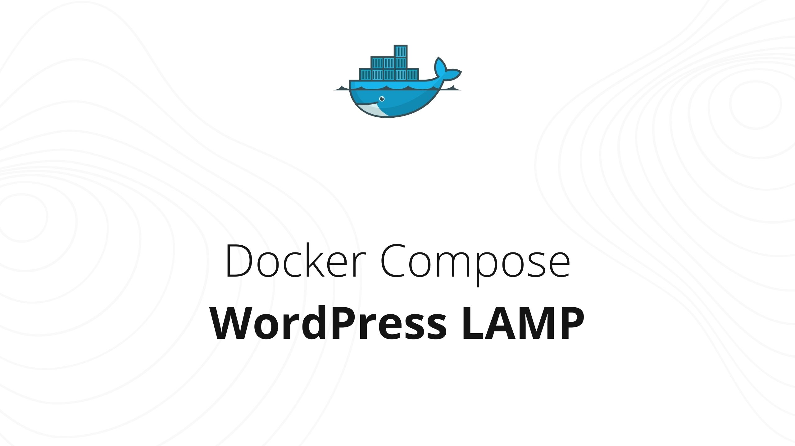
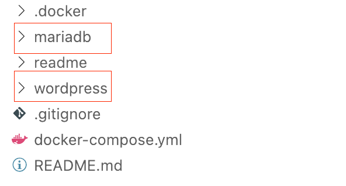
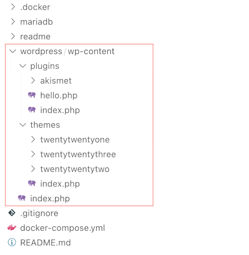

# Docker Compose LAMP - WordPress

Docker Compose project to deploy development environment for WordPress. Configured to store database and files changes locally in project folder matching the purpose of completely storing project in github. Additionally empowered with database manage module and php upload config files.

## Features

- 📦 [WordPress](https://github.com/WordPress/WordPress) and [phpmyadmin](https://github.com/phpmyadmin/phpmyadmin) from the box
- 📧 Ready to use Local Email Testing tool – [Mailhog](https://github.com/mailhog/MailHog)
- 🗂️ Database and file changes storing in project folder
- 🚀 Commit changes to github repository

**For development purpose only, don't use in production.**

## 🚀 Getting Started

### 1. Clone repository

```bash
git clone https://github.com/dendrofen/docker-compose-wordpress-lamp.git
```

### 2. Docker compose

Run docker compose in cloned project folder

```bash
docker-compose up -d
```

### 3. Start your changes

Once docker-compose run completed, modules gonna create new folders in our project folder, wait untill it's over and you can perform changes to source code or manage WordPress admin side.



## 🔗 Interface links

### Mailhog

[http://localhost:8025/](http://localhost:8025/)

### PHPMyAdmin

[http://localhost:8080/](http://localhost:8080/)

| type    | login | password |
| ------- | ----- | -------- |
| Regular | user  | user     |
| Root    | user  | root     |

### WordPress

[http://localhost/](http://localhost/)

## 🧑🏻‍💻 WordPress Environment

### Project Structure

After docker-compose run, next files structure would be created after WordPress initialized, next you can edit these files and folders to perform project changes.

### Persisted wp-content

Changes per this directory would be synced with docker container as normally called - volume persistance. Your changes would be live-synced with docker container and visa-versa.



### PHP settings

**.docker/uploads.ini** file includes settings for php upload media limitations, and scripts processing.

❗️ **Note:** Reload the container to see changes (more in [FAQs](#🛟-faqs))

### Mailhog

WordPress Must use plugins directory _/wp-content/mu-plugins_ contains plugins **mailhog-docker-support** to provide Mailhog module support for WordPress. As far this is mu-plugin, so it run in WordPress by default. You can not disable this plugin, but just remove from your project.

❗️ **Note:** This plugin override settings of WordPress phpmailer

## 🧑🏻‍💻 Database Data

### Local storing

Database data files stored locally in _mariadb_ project folder.
All changes between database would be stored in this folder, so you are free to use this folder as database backup for container.

### Commiting state

More info about commiting database state [here](readme/github-store-changes.md) or in [FAQs](#🛟-faqs)

❗️ **Note:** Stop the container, before commiting database to github.

## 🛟 FAQs

### 🔷 Why default themes and plugins not commited to github?

There is .gitignore file configured to remove these items from repository. See below question.

### 🔷 WordPress default themes and plugins appears on container after been removed?

WordPress default themes and default plugins will appear in container each time _docker-compose up_ command will be processed, because of WordPress latest version installation per each container construction. You can avoide such actions, using just _docker-compose start_ and _docker-compose stop_. **There is also .gitignore** config to prevent these items to be commited.

### 🔷 PHP upload config updated, but no changes?

Changes will appear after container restart:

```bash
docker-compose restart
```

### 🔷 Can project changes being stored on github and reuse on another device with docker?

**Yes, and this is exactly what this repository is made for**. There is small guide how to correctly push changes using this project stack.

[Store changes using Github](readme/github-store-changes.md)
